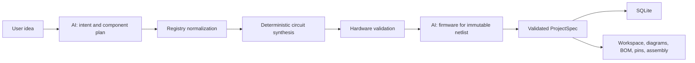
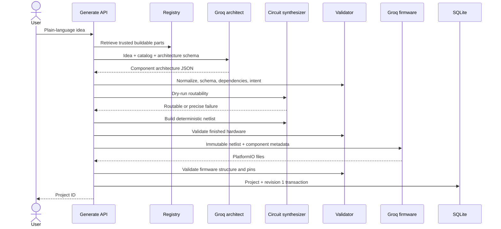
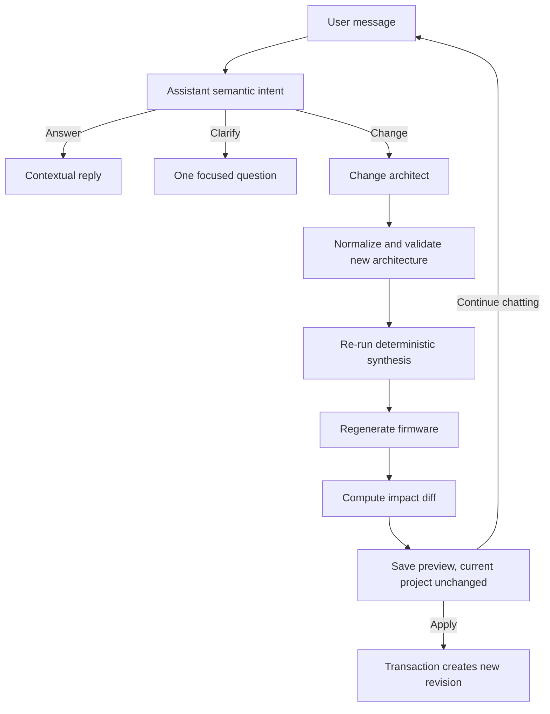

# How Blueprint Works (legacy implementation)

> **Superseded as product direction.** `REQUIREMENTS.md` (locked 2026-07-20) is the vision source of truth: LLM-planned multi-board circuits, part cards + cache, reusable safety checks — not ESP32-only deterministic topology synthesis.
>
> This document remains useful as a map of **what the codebase does today** (2026-07-19 era). When this file disagrees with `REQUIREMENTS.md`, follow `REQUIREMENTS.md` for what to build next; use this file to understand legacy behavior while migrating.

## Contents

1. [What Blueprint is](#1-what-blueprint-is)
2. [The central design decision](#2-the-central-design-decision)
3. [Technology and runtime](#3-technology-and-runtime)
4. [Repository map](#4-repository-map)
5. [The project data model](#5-the-project-data-model)
6. [Complete new-project generation flow](#6-complete-new-project-generation-flow)
7. [The component registry](#7-the-component-registry)
8. [AI and Groq model orchestration](#8-ai-and-groq-model-orchestration)
9. [Deterministic circuit synthesis](#9-deterministic-circuit-synthesis)
10. [Validation and safety layers](#10-validation-and-safety-layers)
11. [Firmware generation](#11-firmware-generation)
12. [Persistence, versions, previews, and messages](#12-persistence-versions-previews-and-messages)
13. [The project assistant](#13-the-project-assistant)
14. [Changing an existing project](#14-changing-an-existing-project)
15. [The web interface](#15-the-web-interface)
16. [Schematic rendering](#16-schematic-rendering)
17. [Compilation and downloads](#17-compilation-and-downloads)
18. [API reference](#18-api-reference)
19. [Configuration](#19-configuration)
20. [Failure handling](#20-failure-handling)
21. [Security and engineering boundaries](#21-security-and-engineering-boundaries)
22. [Current limitations](#22-current-limitations)
23. [Testing and verification](#23-testing-and-verification)
24. [How to extend Blueprint](#24-how-to-extend-blueprint)
25. [Deployment behavior](#25-deployment-behavior)
26. [Worked examples](#26-worked-examples)
27. [Glossary](#27-glossary)

## 1. What Blueprint is

Blueprint is an AI-assisted low-voltage ESP32 project builder. A user describes a device in ordinary language, such as “build a hands-free doorbell,” and Blueprint produces a coherent project containing:

- a selected ESP32 board and component list;
- a deterministic electrical netlist;
- a physical wiring diagram and circuit-style schematic;
- pin assignments;
- a structured bill of materials;
- Arduino/PlatformIO firmware;
- assembly instructions;
- project history and natural-language editing;
- a separate firmware compile check; and
- a downloadable PlatformIO ZIP project.

Blueprint is not a circuit simulator, PCB layout package, electrical certification tool, or universal electronics-design system. It currently targets safe, low-voltage ESP32 breadboard projects that fit its validated component and topology rules.

## 2. The central design decision

Blueprint deliberately separates creative interpretation from electrical authority:

| Responsibility | Owner |
| --- | --- |
| Understand the user's idea | Groq language model |
| Select a minimal set of known parts | Groq language model |
| Normalize part names to trusted records | Blueprint registry code |
| Decide exact wires, pins, rails, and passives | Deterministic circuit synthesizer |
| Check electrical and structural rules | Deterministic validators |
| Generate firmware for the finished netlist | Groq language model, with fallback code |
| Store, render, version, compile, and export | Blueprint application code |

The language model never has final authority over wiring. Earlier versions allowed a model to invent endpoints and frequently produced duplicate terminals, invalid pins, missing grounds, or unsupported component connections. The current architecture asks AI for a component architecture only. Blueprint then creates the netlist using code and validates the result before it can be saved.



This does not mean every project is hard-coded. The synthesizer contains reusable engineering rules for component families, pin contracts, buses, power, grounding, passives, and a small number of special topologies. A project is composed dynamically from those rules. An unfamiliar part still needs trustworthy electrical metadata before Blueprint can safely build with it.

## 3. Technology and runtime

| Area | Current implementation |
| --- | --- |
| Web framework | Next.js 16 App Router |
| UI | React 19 and TypeScript |
| Runtime validation | Zod |
| AI provider | Groq only, through `groq-sdk` |
| Database | Node's synchronous `node:sqlite` `DatabaseSync` |
| Component visuals | `@wokwi/elements` plus generic module fallback |
| Circuit schematic | Circuit JSON adapter and `circuit-to-svg` |
| Firmware framework | Arduino on PlatformIO, Espressif32 platform |
| ZIP creation | JSZip |
| Tests | Node test runner with TypeScript stripping |
| Development server | Next.js Webpack development mode |

Cloudflare Workers AI is not part of the current provider path. The application uses Groq models only.

## 4. Repository map

The important areas are:

| Path | Purpose |
| --- | --- |
| `app/` | Next.js pages, layouts, CSS, and API route handlers |
| `components/` | Interactive workspace, assistant, diagrams, code, BOM, pins, assembly, and history UI |
| `lib/project.ts` | Core schemas, built-in catalog, validators, derived display data, and layout helpers |
| `lib/ai.ts` | Groq calls, model rotation, JSON parsing, timeouts, quota headers, and usage accounting |
| `lib/build-project.ts` | Plan normalization, deterministic build orchestration, firmware validation, and fallback firmware |
| `lib/synthesize-circuit.ts` | Deterministic wiring and pin-allocation engine |
| `lib/component-manifests.ts` | Exact manifest loading, validation, registry merging, and prompt catalog creation |
| `lib/library-components.ts` | Discovery of installed Wokwi elements and schematic-symbol names |
| `lib/assistant.ts` | Context-aware semantic intent classification for project chat |
| `lib/change-project.ts` | Change planning, clarification, rebuild, and impact calculation |
| `lib/db.ts` | SQLite schema and transactional project/version/preview/message operations |
| `lib/circuit-json.ts` | Conversion from Blueprint's project model to the circuit schematic format |
| `component-manifests/` | Curated exact-part JSON manifests |
| `generated/` | Temporary/generated PlatformIO compile workspaces |
| `.platformio/` | Local PlatformIO packages and caches |
| `.venv/` | Project-local Python/PlatformIO environment when installed |
| `blueprint.db` | Local SQLite database created in the process working directory |

The `lib/*.test.ts` files exercise the non-UI engineering and orchestration logic. The API routes are thin adapters around these library functions.

## 5. The project data model

### 5.1 Architecture plan

The first model response is an architecture, not a finished circuit. It contains:

- project title and plain-language summary;
- board choice;
- component instances;
- part list; and
- intended behavior/capabilities.

Each component has a stable internal ID, canonical type or trusted registry identity, display name, quantity, purpose, and registry metadata. Quantities are normalized to one instance per entry. If a model asks for three identical LEDs, Blueprint represents them as three uniquely identified components rather than one component with quantity three. This is necessary because every physical instance needs its own terminals and wires.

### 5.2 ProjectSpec

The saved project is a validated `ProjectSpec`. Conceptually it contains:

```text
ProjectSpec
├── title
├── summary
├── board
├── components[]
├── connections[]
├── parts[]
├── pins[]
├── instructions[]
├── files
│   ├── platformioIni
│   └── mainCpp
└── generationUsage?
```

Important limits enforced by the schemas include:

- no more than 12 component instances;
- no more than 50 connections;
- no more than 30 BOM part entries;
- restricted internal ID formats;
- closed board/component contracts; and
- bounded text and instruction lengths.

### 5.3 Connections and endpoints

A connection is an edge between two explicit endpoints. An endpoint has an owner and a terminal:

```text
board.GPIO26 <--> distance_sensor.TRIG
board.GND    <--> distance_sensor.GND
```

The owner is either `board` or a component ID. The terminal must exist in the selected board profile or the component's trusted pin contract. Connections also carry a purpose and display color.

The netlist is the common source for the wiring diagram, pin table, assembly steps, impact diffs, and firmware prompt. Those views do not independently invent their own wiring.

### 5.4 Internal IDs versus human names

Internal IDs such as `c2` are storage keys, not intended as the primary user-facing identity. Display helpers derive stable reference designators and readable labels, for example:

- `MCU1 — ESP32 DevKit V1`;
- `R1 — 220 Ω resistor`;
- `M1 — SG90 servo`;
- `BZ1 — buzzer`; and
- `U1 — HC-SR04 ultrasonic sensor`.

Those stable labels are reused across the BOM, pin assignments, assistant context, and schematic annotations.

## 6. Complete new-project generation flow

### 6.1 Request entry

The landing page sends a prompt to `POST /api/generate`. The prompt must be a string between 10 and 1000 characters. The API key remains server-side.

### 6.2 Registry preparation

Before calling a model, Blueprint builds a prompt-specific component catalog:

1. load the built-in validated records;
2. load and validate local exact-part manifests;
3. inspect the installed Wokwi Elements package;
4. inspect the installed schematic-symbol list;
5. search/rank records against the user's words; and
6. provide the model with the relevant buildable subset, currently capped at 60 entries for generation.

The generation route requests a complete buildable registry where needed so common parts are not accidentally hidden by narrow retrieval. Visual-only discoveries are not offered as electrically usable components.

Blueprint also scans the user prompt for explicit-looking part numbers. If the user explicitly names a part that the registry cannot identify safely, generation stops before the AI call and returns a clear unsupported-part error.

### 6.3 Architecture model call

The architect prompt tells Groq to:

- select the smallest safe hardware set that satisfies the request;
- use only supplied registry identities;
- infer genuinely required passives and driver modules;
- use unique quantity-one physical instances;
- avoid unrelated decorative hardware;
- represent an ESP32 camera request with the ESP32-CAM board and its built-in OV2640 camera;
- remain within low-voltage supported scope; and
- return JSON matching the architecture contract.

The route can make up to three planning attempts. A failed attempt is not blindly repeated: validation feedback is appended so the next attempt can correct the specific plan.

### 6.4 Plan normalization

Models do not always wrap JSON identically. `normalizeArchitecture` accepts the supported shapes, including:

- a direct architecture object;
- an object wrapped in `project`, `architecture`, or `plan`;
- a component array;
- `{ "components": { "items": [...] } }`; or
- a keyed component object.

Normalization then:

1. removes a duplicate ESP32 controller from the component list because the board is stored separately;
2. resolves each part to a trusted registry record using exact identity, distinctive model number, then unique fuzzy containment;
3. discards registry metadata supplied by the model;
4. injects metadata from Blueprint's trusted record;
5. canonicalizes and deduplicates IDs;
6. forces one physical instance per entry;
7. canonicalizes component names and types;
8. maps a camera board description to `esp32cam`, otherwise to `esp32dev`; and
9. rebuilds the BOM inputs from the normalized board and components.

The model therefore cannot gain electrical privileges by claiming arbitrary pins or a false support level in its JSON.

### 6.5 Architecture validation

The normalized plan passes through several gates:

- Zod structural validation;
- component dependency validation;
- prompt intent coverage validation; and
- a full dry run of deterministic circuit synthesis.

The dry run matters because a component list can be individually valid but impossible on the selected board. For example, too many independent signals may exceed the safe pins available on ESP32-CAM. That error is caught while still planning, and feedback asks the architect to keep required functions while removing optional hardware first.

### 6.6 Circuit construction

Once an architecture is accepted, `buildProject` calls the deterministic circuit synthesizer. The synthesizer chooses exact board pins and creates all wires. It can also receive preserved connections when rebuilding a changed project.

The resulting netlist is parsed into the full project schema and passed to hardware validation. No firmware is requested until the hardware passes.

### 6.7 Firmware construction

The validated component catalog and immutable netlist are then sent to the firmware model. The model may create only:

- `platformio.ini`; and
- `src/main.cpp`.

It is explicitly forbidden from changing the components, connections, or pin choices. Firmware output is checked before acceptance. If every model attempt fails, Blueprint uses deterministic fallback firmware so provider formatting failures do not necessarily destroy an otherwise valid project.

### 6.8 Saving and redirecting

The final `ProjectSpec` receives a UUID. Before saving, prompt intent coverage is checked again. SQLite then stores the project and creates revision 1 in one transaction. The client receives the project ID and opens the project workspace.



## 7. The component registry

### 7.1 Why a registry is necessary

A picture of a component is not enough to wire it. Blueprint needs, at minimum:

- terminal names;
- electrical roles;
- permitted board-pin classes;
- power and voltage expectations;
- interface type;
- required companion components;
- firmware/library guidance; and
- a known safe topology.

Wokwi Elements supplies excellent browser visuals, but it is not automatically a complete engineering database. Blueprint treats visual discovery and electrical support as different facts.

### 7.2 Registry layers

Blueprint merges three sources:

1. **Built-in records.** Hand-validated component definitions in `lib/project.ts`, including pins, constraints, Wokwi tags, descriptions, and firmware hints.
2. **Exact local manifests.** JSON files in `component-manifests/` for named parts such as PAM8403, a 4-ohm speaker, JST-XH, and VL53L0X.
3. **Installed-library discovery.** Runtime inspection of Wokwi element modules and schematic-symbol declarations.

### 7.3 Support levels

Registry entries carry a support level:

| Level | Meaning |
| --- | --- |
| `validated` | Blueprint has an explicit trusted contract and supported synthesis behavior. |
| `generic-family` | The part safely matches a known family contract such as I2C, SPI, UART, or digital sensor. |
| `datasheet-derived` | Pin metadata was curated from a trusted technical source but may need topology support. |
| `visual-only` | A drawing/symbol is known, but Blueprint lacks enough electrical truth to wire it. |
| `unsupported` | Deliberately excluded, with a reason. |

Only buildable entries with usable pins enter generation prompts. A visual-only symbol can still be listed in registry diagnostics but cannot be selected as if it were electrically supported.

### 7.4 Wokwi discovery

`lib/library-components.ts` examines installed `@wokwi/elements/dist/esm/*-element.js` modules and extracts declared `pinInfo`. Exact recognizable pin patterns can be mapped to safe generic families. Unknown pin sets remain visual-only.

Some Wokwi elements are explicitly excluded, including alternate controller boards, test accessories, and bare parts whose required safe driver topology is not implemented. Exclusion is intentional: silently pretending they are usable would recreate the invalid-wiring problem.

Discovery is local. Blueprint scans the installed npm package; it does not make a live request to Wokwi's website during every project generation.

### 7.5 Schematic-symbol discovery

Blueprint also reads names shipped by `schematic-symbols`. These records improve awareness and presentation, but a symbol name has no trustworthy pin contract. Consequently, these discoveries are visual-only until a manifest or built-in definition supplies electrical metadata.

### 7.6 Exact component manifests

A JSON manifest can register an exact component without modifying the main catalog code. A manifest includes:

- stable ID, name, aliases, and category;
- capabilities and source information;
- support level;
- either a validated `baseType` or explicit exact pins;
- permitted board-pin choices;
- description and firmware notes; and
- dependency requirements.

Manifest loading is strict. Invalid files are quarantined as registry errors rather than crashing generation. Duplicate built-ins, duplicate manifests, unsafe board-pin declarations, and missing base families are rejected.

The README in `component-manifests/` states the conservative default: inherit a validated base type rather than inventing arbitrary electrical behavior. The loader also supports exact pin contracts, but an exact contract still needs synthesis rules capable of using those roles safely.

### 7.7 Registry search

Search weights exact identity/alias matches most strongly, then contextual matches, with a bonus for safe base records. The registry is used internally to retrieve relevant model context and is also exposed through `/api/components` for diagnostics or a component browser.

## 8. AI and Groq model orchestration

### 8.1 AI stages

`lib/ai.ts` defines four primary logical stages:

- `architect`: new-project component selection;
- `change`: existing-project change planning;
- `assistant`: assistant intent and reply planning; and
- `firmware`: PlatformIO file generation.

The stages use `GROQ_ARCHITECT_MODELS`, `GROQ_CHANGE_MODELS`, `GROQ_ASSISTANT_MODELS`, and `GROQ_FIRMWARE_MODELS`. `GROQ_BUILDER_MODELS` remains a backward-compatible fallback for assistant and firmware configuration.

### 8.2 Default model order

If environment variables are absent, code uses task-specific pools:

- architect: GPT-OSS 120B, GPT-OSS 20B, Llama 4 Scout, and Qwen3 32B;
- change planning: GPT-OSS 120B, Llama 4 Scout, Qwen3 32B, and GPT-OSS 20B;
- assistant: Llama 3.1 8B Instant, Llama 3.3 70B, Llama 4 Scout, and GPT-OSS 20B;
- firmware: Qwen3 32B, Qwen3.6 27B, GPT-OSS 120B, Llama 3.3 70B, and GPT-OSS 20B.

The environment value wins. A deployment should use model IDs that are actually enabled for its Groq account.

### 8.3 Rotation and retries

The Groq SDK itself is configured with `maxRetries: 0`. Blueprint owns the retry behavior so failures are visible and controlled. It selects among healthy models in the relevant task pool using observed quota, cooldown, and least-recently-used state. A 429 cools down that model using Groq's `retry-after` header, while a permission failure removes it from immediate rotation for a longer interval.

Groq is normally asked for a JSON object with temperature zero. If Groq returns its `json_validate_failed` 400 response, Blueprint retries that same model once without constrained JSON response mode and parses the returned text itself. Markdown code fences are removed before parsing.

### 8.4 Timeouts

Default per-call timeouts are:

- architect: 45 seconds;
- builder: 90 seconds; and
- firmware: 30 seconds.

They are configurable. An abort signal terminates a request after its limit. The outer generation/change loops may still try another configured model after one model times out.

Per-call limits also sit inside overall operation deadlines: new-project generation is bounded to 90 seconds, change planning/building to 75 seconds, and conversational interpretation to 30 seconds. Remaining time is passed into every model call, so sequential fallbacks cannot turn one operation into an unbounded multi-minute wait. Firmware falls back deterministically when its remaining model budget is exhausted.

### 8.5 Usage and quota display

The server records observed calls, prompt/completion token usage, provider/model names, and the latest Groq quota headers in a `globalThis` in-memory state so it survives Next.js hot reloads in one process. It does not persist this accounting to SQLite and it resets on a full process restart.

The provider endpoint reports:

- estimated normal generation load: three calls and roughly 8,500 tokens;
- current in-process session usage;
- configured models; and
- the latest quota values Groq returned.

This is an estimate and observation, not a guaranteed live billing meter.

## 9. Deterministic circuit synthesis

### 9.1 Inputs and outputs

The synthesizer receives:

- a normalized board;
- trusted component instances and pin contracts; and
- optional required connections that must survive a project edit.

It returns the same architecture enriched with exact connections and standard safety-oriented assembly instructions.

### 9.2 Board profiles

The ESP32 DevKit profile exposes a broad set of safe GPIOs plus VIN, 3V3, and GND rails. The current ESP32-CAM profile deliberately exposes only GPIO13 and GPIO14 for general external connections, plus power/ground. Camera-reserved pins are not offered to ordinary peripherals.

This conservative ESP32-CAM profile prevents camera conflicts, but it also means projects requesting several independent external signals may fail the routability gate with an explicit pin-capacity error.

### 9.3 Pin allocation

The `claim` operation chooses the first available pin from a component's permitted candidates. Signal GPIOs are not reused unless the interface is explicitly shareable. When no pin is available, the error reports:

- selected board;
- requested candidate pins;
- pins already assigned; and
- that the circuit exceeds the current safe profile.

Power and ground rails are intentionally shareable. I2C data and clock lines are shareable among I2C devices.

### 9.4 Wire identity and colors

Every connection is normalized as an undirected endpoint pair and deduplicated. Power is red, ground is dark, and signals rotate through a readable palette. Color aids visual tracing but does not define electrical meaning; terminal roles and connection purposes do.

### 9.5 Special topologies

Some hardware requires more than generic pin matching. The synthesizer has explicit rules for:

| Topology | Deterministic behavior |
| --- | --- |
| LED | Adds series resistor path and ground, with a claimed output GPIO. |
| RGB LED | Uses three series resistors for color channels and a common ground. |
| HC-SR04 | Connects VIN/GND/TRIG and constructs a two-resistor ECHO voltage divider before an ESP32 input. |
| Stepper system | Requires matching A4988 and external supply, connects logic, STEP/DIR/EN, VMOT, common ground, and four motor coils. |
| PAM8403 audio | Connects DAC-capable GPIO25/26 inputs, power, and bridge-tied speaker outputs; speaker negative terminals are never grounded. Optional JST connectors are handled in the topology. |
| PCA9685 servo expansion | Uses two I2C signals to drive up to eight modeled servos, assigns one channel per servo, requires a separate regulated 5 V servo supply, and enforces a shared ESP32 ground. On ESP32-CAM, GPIO13/GPIO14 carry the validated I2C bus. |

These are reusable topologies, not project templates. The model can combine them with other supported components as long as the selected board has enough resources.

### 9.6 Generic family rules

For components that fit established contracts, synthesis handles:

- pushbuttons and slide switches;
- potentiometers;
- rotary encoders and joysticks;
- digital inputs and outputs;
- analog inputs;
- shared I2C SDA/SCL buses;
- power and ground terminals; and
- trusted per-terminal board-pin candidate lists.

Some optional output terminals such as interrupt or square-wave pins may remain unconnected when they are not needed by the requested behavior.

### 9.7 Completion condition

Every selected component must participate in at least one supported connection or topology. If the registry knows a component visually but the synthesizer cannot safely connect it, the build fails instead of drawing plausible-looking nonsense.

### 9.8 Assembly instructions

The synthesizer adds standard instructions covering power disconnection, component placement, following labeled wire endpoints, checking grounds/polarity, and only then powering/testing. The UI also derives detailed per-wire assembly steps from the validated netlist.

## 10. Validation and safety layers

Validation is layered because a valid JSON object can still describe an invalid circuit.

### 10.1 Structural validation

Zod enforces field types, sizes, enumerations, endpoint shapes, and component limits. Trusted dynamic registry entries may use exact pin contracts; built-in types use their closed catalog definitions.

### 10.2 Architecture dependency validation

Examples include:

- one A4988 driver per stepper motor;
- external motor supply required with a stepper driver;
- external motor supply forbidden when no driver needs it;
- adequate resistor counts for LEDs, RGB LEDs, and HC-SR04 dividers.

### 10.3 Intent coverage validation

Blueprint maps user concepts such as camera, temperature, humidity, display, distance, PIR motion, potentiometer, servo, stepper, LED, buzzer, audio amplifier, and loudspeaker to required capabilities. It checks that the selected architecture covers explicit user intent.

This prevents a “motion-tracking camera” plan from silently containing motion sensing and a servo but no camera.

### 10.4 Hardware validation

After synthesis, `validateHardware` checks:

- every endpoint owner exists;
- every terminal exists in its trusted contract;
- direct board connections use allowed board pins;
- non-shareable component terminals are not wired twice;
- exact duplicate wires do not exist;
- every selected component is connected;
- one GPIO is not assigned multiple incompatible signals;
- assembly text does not mention nonexistent passives;
- the instructions include disconnecting power;
- a shared board ground exists;
- LED series resistors exist;
- A4988, motor supply, common-ground, and coil topology is complete;
- component IDs are unique; and
- topology-specific rules such as bridge-tied speaker wiring are respected by construction.

All detected errors are deduplicated before presentation.

### 10.5 Firmware validation

Firmware checks are separate from hardware checks. A project can be electrically validated but not yet compiled. Before accepting model-generated files, Blueprint verifies:

- PlatformIO targets `espressif32` and the correct board;
- Arduino `setup()` and `loop()` exist;
- required libraries are appropriate;
- servo projects use ESP32Servo rather than an incompatible generic Servo library;
- ESP32-CAM projects contain a complete `esp_camera` initialization, pin map, and capture/server behavior; and
- every numeric GPIO used by the netlist is represented in the code.

This is static application validation, not a real compiler invocation. Compilation happens only when the user runs Compile / Check.

### 10.6 Meaning of “validated”

“Validated” means the project passed Blueprint's schemas and currently implemented engineering rules. It does not mean:

- the circuit was simulated;
- the hardware was physically tested;
- all current/thermal/tolerance behavior was analyzed;
- a qualified engineer certified it;
- regulatory requirements were checked; or
- the firmware successfully compiled unless compile status separately says so.

## 11. Firmware generation

### 11.1 Immutable hardware context

The firmware model receives the finalized netlist, component metadata, descriptions, and firmware hints. Its prompt says hardware is immutable. This reverses the unsafe pattern where code and wiring could independently choose different pins.

### 11.2 Model attempts

Blueprint makes up to two firmware attempts. The model has a larger output allowance than the architecture planner because it must return complete source files. Invalid output is fed back for repair or another model is tried.

### 11.3 Deterministic fallback

If provider calls or firmware validation fail, Blueprint can still finish a hardware-valid project with fallback source:

- a PAM8403 Bluetooth-speaker topology gets a specialized A2DP/I2S baseline using AudioTools and ESP32-A2DP on GPIO25/26;
- other projects receive a generic safe Arduino baseline with constants and pin modes inferred from the netlist.

The generic fallback is deliberately conservative. It can preserve pin consistency and basic structure, but it may not implement the user's full intended behavior. Blueprint adds an instruction note when fallback firmware was used. This is a resilience mechanism, not equivalent to successful AI-generated functional firmware.

### 11.4 Generated files

Every project stores exactly the primary PlatformIO configuration and main C++ source. The UI presents these as file tabs and the ZIP places them at:

```text
platformio.ini
src/main.cpp
```

## 12. Persistence, versions, previews, and messages

### 12.1 Database location and lifecycle

`lib/db.ts` opens `blueprint.db` in the current working directory and caches the `DatabaseSync` connection globally. Tables are created on access. There is no separate migration framework today.

### 12.2 Tables

| Table | Stored data |
| --- | --- |
| `projects` | Current project ID, original prompt, current serialized spec, creation time. |
| `project_revisions` | Immutable version snapshots, revision number, change request, summary, timestamp. |
| `change_previews` | Pending/applied proposed specs, request, impact JSON, timestamps. |
| `assistant_messages` | User/assistant role, message kind, content, optional metadata, timestamp. |

The API key is never stored in the database.

### 12.3 Serialization

Project specs are stored as JSON text. Every read reparses the JSON through `ProjectSpecSchema`; corrupt or obsolete data does not silently enter the UI as trusted state.

### 12.4 Transactions

State transitions use `BEGIN IMMEDIATE` transactions with rollback on failure:

- creating a project writes the current project and revision 1 together;
- applying a preview updates current state, creates the next revision, and marks the preview applied together;
- restoring an old version copies it into a new current revision rather than deleting history.

### 12.5 Preview supersession

Saving a new preview marks earlier unapplied previews as superseded. This prevents the user from accidentally applying an older proposal after the conversation has moved on.

### 12.6 Revision semantics

Revisions are append-only snapshots. Restoring revision 2 when the project is at revision 5 creates revision 6 with revision 2's content. Audit history remains intact.

### 12.7 Assistant history

The assistant retrieves the latest 30 stored messages and returns them in chronological order. Model context uses the most recent 16 messages to keep prompts bounded while retaining the immediate conversation.

## 13. The project assistant

### 13.1 Primary-context rule

The assistant can answer general electronics questions, but the current project is always its primary context. It receives:

- exact current project title and summary;
- board and trusted component list;
- validated connections;
- current firmware;
- original user prompt;
- recent conversation; and
- relevant registry entries and limitations.

It is told not to invent components or connections that are absent.

### 13.2 Semantic intent, not phrase matching

The model classifies every message into one of three intents:

- `answer`: explain the project or answer an electronics question;
- `clarify`: ask one necessary behavior/external-constraint question; or
- `change`: produce a standalone requested project change.

There is no hard-coded “go ahead” keyword path. The assistant uses conversation context to understand whether “yes,” “do it,” or a differently worded reply authorizes the previously discussed modification.

### 13.3 Clarification policy

The assistant should ask only when user intent materially changes the design and cannot safely be inferred. It should ask about desired behavior or genuine external constraints, not burden the user with selecting GPIO numbers, voltage-divider values, or routine implementation details Blueprint should decide.

### 13.4 Pending-preview context

If a conversational change preview already exists, subsequent assistant messages use that preview as the working project context. This allows questions or follow-on changes to refer to what the user is currently considering, not only the last applied version.

## 14. Changing an existing project

### 14.1 End-to-end change flow



### 14.2 Change planning

The change planner receives the entire current project and a relevant registry catalog. It must preserve unaffected behavior, use trusted parts, infer technical implementation, and return:

- its understanding of the requested change;
- an optional clarification question;
- the proposed full replacement architecture;
- a summary;
- declared scope;
- risk; and
- warnings.

It can try up to three models/repairs. The resulting architecture passes the same normalizer, schema, dependency, intent, routability, synthesis, hardware, and firmware pipeline as a new project.

### 14.3 Preserving unaffected wiring

Connections are candidates for preservation only when their component IDs and types remain stable. Board-connected wires are not forced to survive a board replacement, because the new board may have different safe pins. The deterministic synthesizer treats preserved connections as requirements and allocates the rest around them.

### 14.4 Anti-staleness checks

The planner checks for stale references to replaced components in the new title, summary, and project content. It also catches known semantic mismatches, such as describing a rotary control as analog while selecting a digital rotary encoder.

### 14.5 Impact calculation

Blueprint calculates impact from actual before/after data rather than trusting the model's declared risk. It compares:

- added, removed, and changed components;
- board changes;
- the symmetric difference of connection sets; and
- firmware changes.

If the model calls a change firmware-only but hardware actually differs, Blueprint upgrades the scope and risk. High-risk previews are shown but blocked from direct application in the current UI.

### 14.6 Apply and restore

Previewing never mutates the current project. Applying creates a new version transactionally and records an assistant “applied” message. History restore also requires confirmation and creates a new version.

## 15. The web interface

### 15.1 Landing page

The home screen contains:

- the project idea input;
- generation status and actionable faults;
- Groq call/token estimate and observed quota data; and
- recent projects.

### 15.2 Project workspace

The workspace uses the blueprint visual system based on `#075299`, a darker blue technical grid, white lines, compact engineering typography, and white panels/controls.

Main views are:

1. Overview
2. Schematic
3. Firmware
4. BOM
5. Pins
6. Assembly
7. Changes

The selected view is stored in the `?view=` URL parameter so refresh/back/forward navigation behaves predictably. Switching views resets the main content scroll position.

### 15.3 Rails and responsive behavior

The assistant rail and project/navigation rail can be collapsed on desktop. At tablet/mobile widths they become drawers. Smaller layouts adjust controls and tables for touch. The UI includes visible focus states, reduced-motion handling, readable contrast, and keyboard-accessible controls.

### 15.4 Overview

Overview summarizes the project, board, validated state, component schedule, and key build information. Hardware validation and compile state are presented separately.

### 15.5 Firmware view

The code viewer provides file tabs, copy, wrapping, and export controls. It presents stored source; it does not execute code in the browser.

### 15.6 BOM

The BOM is derived from the project data and grouped/deduplicated into readable rows with stable references and quantities. It can be exported as CSV and printed.

### 15.7 Pins

The pin assignment table is derived directly from validated connections. It uses readable component references rather than only internal IDs. Selecting a row can locate/highlight its corresponding wire. CSV export and print styling are available.

### 15.8 Assembly

Detailed assembly steps are generated from the validated connections, so the written endpoint pairs match the diagram and pin table. The view has checkboxes/progress, wire location, export, and print treatment.

The downloadable README currently uses the stored synthesis instructions, while the richer on-screen step list is derived at render time from the netlist.

### 15.9 Changes and history

The assistant-driven Changes area shows conversation, clarification, preview impact, risk, and apply controls. History shows version diffs and requests confirmation before restoring an older snapshot.

### 15.10 Loading and failure states

The interface includes generation, assistant, compile, registry, empty, retry, and page-level error states. Client-side assistant requests can be aborted so the UI does not remain permanently stuck when navigating or retrying.

## 16. Schematic rendering

Blueprint has two schematic presentations backed by the same netlist.

### 16.1 Physical wiring view

The primary physical view renders known components with Wokwi custom elements. Unsupported visuals use a labelled generic module instead of crashing. Terminals are positioned with component adapters and measured from the DOM.

Wires are a separate SVG overlay. The renderer:

1. collects terminal element references;
2. measures their coordinates;
3. observes size changes with `ResizeObserver`;
4. recalculates on window resize;
5. routes deterministic orthogonal paths through stable lanes; and
6. draws labels and accessible interactive targets.

Hovering, focusing, or clicking a wire/pin cross-highlights the same connection across relevant views. Fit and reset controls remount/recalculate the diagram when layout becomes stale.

This is a deterministic schematic router, not a PCB autorouter. It uses stable orthogonal lanes; it does not perform full obstacle optimization, bus bundling, PCB trace planning, or electrical simulation.

### 16.2 Circuit-style schematic

`lib/circuit-json.ts` converts the validated project to a supported Circuit JSON subset. It lays the board on the left, components in columns on the right, emits source/schematic components and ports, and creates orthogonal traces with safe encoded IDs.

The server project page passes that data through `circuit-to-svg` and embeds the SVG as a data URL. If conversion fails, the error is logged and the physical wiring view remains available. Blueprint's `ProjectSpec`, not Circuit JSON, remains the source of truth.

## 17. Compilation and downloads

### 17.1 Compile / Check

Compilation is an explicit user action. The route:

1. loads the stored validated project;
2. writes `generated/<project-id>/platformio.ini`;
3. writes `generated/<project-id>/src/main.cpp`;
4. chooses `PLATFORMIO_PATH` or the local `.venv/Scripts/pio.exe`;
5. runs PlatformIO with a project-local `.platformio` core directory;
6. enforces a 180-second process timeout and a 1 MB output buffer; and
7. returns a bounded tail of compiler output, currently up to 6,000 characters.

Compiler success/failure is displayed in a dedicated panel and does not overwrite hardware-validation status.

The original requirements proposed an isolated Docker worker. The current implementation invokes a local PlatformIO process from the Next.js server. Production isolation, per-job filesystem cleanup, and concurrency limits still need deployment hardening.

### 17.2 First compile cost

The first compile can take several minutes because PlatformIO downloads the ESP32 toolchain and libraries into `.platformio`. Later builds reuse that cache.

### 17.3 ZIP download

The download route uses JSZip and includes:

- `platformio.ini`;
- `src/main.cpp`; and
- a README with project summary and stored assembly instructions.

The ZIP is generated from the saved validated project. A compile is not automatically required before download.

### 17.4 Print and export

The workspace has print-specific CSS and exports for BOM, pins, schematic/assembly information, and source. Browser print can be used to create PDF output.

## 18. API reference

| Endpoint | Method | Purpose |
| --- | --- | --- |
| `/api/generate` | POST | Validate prompt, select components with Groq, synthesize/validate circuit, generate firmware, save project. |
| `/api/components` | GET | Search the federated registry and return source/support statistics and manifest errors. |
| `/api/providers` | GET | Return configured Groq model information, in-process usage, observed quota, and registry statistics. |
| `/api/projects` | GET | Return recent projects with latest revision/update data. |
| `/api/projects/[id]/assistant` | GET | Return recent messages and a relevant pending conversational preview. |
| `/api/projects/[id]/assistant` | POST | Store a message, classify answer/clarify/change, and possibly create a preview. |
| `/api/projects/[id]/changes` | POST | Plan and save a project-change preview without applying it. |
| `/api/projects/[id]/changes` | PUT | Apply a pending preview as a new revision. |
| `/api/projects/[id]/revisions` | GET | List versions and diffs relative to the current project. |
| `/api/projects/[id]/revisions` | POST | Restore a selected old snapshot by creating a new current revision. |
| `/api/projects/[id]/firmware-check` | POST | Compile stored PlatformIO firmware and return bounded diagnostics. |
| `/api/projects/[id]/download` | GET | Generate and return the project ZIP. |

Common response classes are:

- `400`: malformed user input;
- `404`: project/preview/revision not found;
- `422`: understood request but unsupported/invalid engineering result;
- `429`: Groq rate/quota exhaustion; and
- `500`: unexpected application/provider failure.

Exact status handling varies slightly by route, but provider, schema, and engineering errors are converted to user-facing messages rather than exposing the API key.

## 19. Configuration

### 19.1 Required environment value

```dotenv
GROQ_API_KEY=your_server_side_key
```

The key must remain in `.env` or `.env.local`, never in client code or committed files.

### 19.2 Model lists

```dotenv
GROQ_ARCHITECT_MODELS=model-a,model-b
GROQ_BUILDER_MODELS=model-c,model-d
```

Values are comma-separated and tried in order. Firmware uses the builder model list.

### 19.3 Timeouts

```dotenv
AI_ARCHITECT_TIMEOUT_MS=45000
AI_BUILDER_TIMEOUT_MS=90000
```

The builder timeout setting is used by both builder and firmware stages as their configured override; without an override, code uses the stage defaults described earlier.

### 19.4 PlatformIO

```dotenv
PLATFORMIO_PATH=C:\path\to\pio.exe
```

If omitted, Blueprint looks for the project-local Windows executable under `.venv/Scripts/pio.exe`.

### 19.5 Commands

```powershell
npm install
npm run dev
npm test
npm run lint
npm run build
npm start
```

`npm run dev` explicitly uses Webpack. `npm run lint` currently means TypeScript checking with `tsc --noEmit` rather than ESLint.

## 20. Failure handling

### 20.1 “No model produced a valid component plan”

Every configured architect model either failed, timed out, returned unparsable/schema-invalid output, selected unsupported parts, missed required intent, violated dependencies, or produced an unroutable component set. The nested message should identify the last concrete cause.

### 20.2 “No available ESP32 terminal satisfies …”

The requested component architecture needs a signal pin whose allowed candidates are already occupied or unavailable on the selected board profile. This is a deterministic capacity/topology failure, not a random model-formatting failure.

### 20.3 “Unsupported endpoint …”

A connection references a terminal absent from the trusted component contract. Current production generation should avoid this because AI no longer creates wiring. It can still appear when loading obsolete saved data, processing legacy code paths/tests, or when a manifest/topology contract is inconsistent.

### 20.4 Duplicate wiring

A non-shareable terminal was connected more than once or the same edge was duplicated. Deterministic synthesis deduplicates edges and claims terminals, so repeated occurrences indicate a topology implementation defect, preserved-connection conflict, or legacy project rather than something to repair with a looser prompt.

### 20.5 Groq JSON validation failure

Groq rejected or failed to form the constrained JSON response. Blueprint retries the same model without constrained mode, then rotates if necessary. Continued failure means no configured model returned parseable, valid data within the attempts.

### 20.6 Timeout

The provider did not respond before the stage limit, the browser aborted, or PlatformIO exceeded its compile limit. Model rotation handles individual AI timeouts; compile timeout returns bounded diagnostics.

### 20.7 Unsupported component

Blueprint may know a visual or name but lack a safe electrical contract/topology. It rejects the component instead of fabricating wiring. Adding a manifest alone is sufficient only when an existing generic family/topology can safely handle it; genuinely new electrical behavior requires a synthesis rule and tests.

### 20.8 Page/render failure

Known Wokwi tags render as custom elements; unknown tags fall back to a generic module. Circuit-SVG conversion is secondary and can fail without eliminating the physical wiring view. Next.js error UI provides reload/back actions for unrecoverable component errors.

## 21. Security and engineering boundaries

Blueprint currently enforces these important boundaries:

- Groq credentials are read only on the server;
- model-supplied registry metadata is discarded;
- wiring is deterministic and validated;
- project JSON is validated both before storage and after retrieval;
- SQL values use bound parameters;
- version-changing operations are transactional;
- dangerous categories such as mains power, lithium charging, medical, and safety-critical control are outside generation prompts;
- generated firmware is compiled, not run as a native server program; and
- compiler output is bounded before returning to the browser.

However, this is not a hardened multi-user SaaS security model. There is currently no authentication, authorization, tenant isolation, API rate limiter, job queue, containerized compiler worker, CSRF design for authenticated users, or database encryption layer.

## 22. Current limitations

### 22.1 Hardware scope

- ESP32 DevKit V1 and ESP32-CAM are the practical board profiles.
- The ESP32-CAM external-pin profile is intentionally narrow.
- The registry is broadening but does not safely support every electronic part.
- Visual discovery is not equivalent to electrical support.
- Complex drivers and analog circuits require explicit topologies.
- Maximum project size is intentionally bounded.

### 22.2 Engineering depth

- No SPICE or behavioral simulation.
- No PCB placement/routing, Gerbers, impedance control, or design-rule checking.
- No automatic current-budget, thermal, tolerance, EMI, battery-life, or regulatory analysis.
- No full obstacle-avoiding diagram autorouter or automatic bus grouping.
- No guarantee that an assembled real circuit works without review/testing.

### 22.3 AI behavior

- Model availability, rate limits, and output quality still affect component interpretation and rich firmware.
- Multiple models improve resilience but cannot make an unsupported topology safe.
- The generic firmware fallback may be structurally valid without implementing full behavior.
- Session quota/token telemetry is in-memory and approximate.

### 22.4 Application operations

- SQLite is a single local file with synchronous access.
- There is no schema migration framework or cloud database adapter.
- Compiler jobs run in the web-server process environment rather than an isolated worker.
- No user accounts or access controls.
- No background queue, distributed locking, or horizontal multi-instance coordination.
- Generated build directories and PlatformIO caches need lifecycle management in production.

### 22.5 Documentation drift

`REQUIREMENTS.md` describes the original vertical slice. It still mentions Tailwind, strict structured output as the sole path, Docker compilation, and ESP32 DevKit-only scope. The current code uses custom CSS, flexible JSON recovery, local PlatformIO execution, ESP32-CAM support, a project assistant, revision history, and deterministic synthesis.

## 23. Testing and verification

### 23.1 Commands

```powershell
npm test
npm run lint
npm run build
```

- `npm test` runs the `lib/*.test.ts` suite with Node's test runner.
- `npm run lint` performs strict TypeScript checking.
- `npm run build` verifies the production Next.js build and route compilation.

### 23.2 What tests cover

The library tests cover areas including:

- component registry and manifest behavior;
- architecture normalization;
- deterministic synthesis and special topologies;
- hardware validation;
- assistant/change interpretation schemas;
- project diffs and derived UI data;
- Circuit JSON conversion; and
- regressions for previously observed invalid endpoints, duplicate wires, missing dependencies, and board-pin exhaustion.

### 23.3 What tests do not fully prove

Unit tests and a production build do not replace:

- live Groq tests against every configured model;
- browser end-to-end tests for every interaction;
- compilation of every generated firmware combination;
- physical hardware tests; or
- load, concurrency, and long-running deployment tests.

A robust release gate should add a fixed corpus of representative ideas, mock-model architecture fixtures, expected deterministic netlists, firmware compilation jobs, and Playwright flows for generation, chat, preview, apply, restore, diagrams, and export.

## 24. How to extend Blueprint

### 24.1 Add an alias or exact variant of an existing family

When the new part is electrically equivalent to a validated family:

1. add a JSON manifest in `component-manifests/`;
2. inherit the correct `baseType`;
3. add name/model aliases and source information;
4. run registry tests;
5. generate a project using the exact part name; and
6. verify the diagram, pin table, firmware, and compile result.

### 24.2 Add a genuinely new component family

When pin roles or electrical behavior are new:

1. define a trusted electrical contract in the catalog or manifest layer;
2. define allowed board-pin classes and firmware hints;
3. add dependencies and intent capabilities;
4. add a generic-family rule or explicit topology in `synthesize-circuit.ts`;
5. add matching hardware validators when construction alone is insufficient;
6. add visual terminal-position support or accept the generic module;
7. add positive and negative tests;
8. compile representative firmware; and
9. only then mark the part buildable.

### 24.3 Add a new board

A new board requires more than a name:

1. board identity and PlatformIO board ID;
2. physical rails and safe external pin profile;
3. pin capabilities such as ADC, DAC, PWM, I2C, SPI, UART, input-only, and reserved pins;
4. visual/terminal layout;
5. firmware platform rules;
6. conflict and capacity tests; and
7. compiler verification.

### 24.4 Add a new AI provider

The current design is Groq-only. A provider addition should implement the same stage contract, abort behavior, usage capture, model rotation semantics, JSON parsing, error normalization, secret isolation, and tests. It should not bypass registry normalization or deterministic synthesis.

## 25. Deployment behavior

### 25.1 Files that must persist

For a Railway-style deployment, `blueprint.db` must live on a persistent volume or all projects disappear when the container is replaced. PlatformIO's `.platformio` cache should also persist if fast repeat compilation matters. Generated compile workspaces may be temporary.

### 25.2 Single-instance fit

SQLite and in-process AI usage state are best suited to one application instance. Multiple replicas would each have separate memory and, without a carefully mounted/shared database strategy, inconsistent project state. A network database and shared job queue are the natural later step for horizontal scaling.

### 25.3 Memory and startup

Large memory spikes are more likely to come from Next.js development compilation, source maps, dependency graphs, and PlatformIO/toolchain processes than from the deterministic router itself. Rewriting the app in Rust would not fix model latency, invalid model JSON, missing engineering metadata, or Node development bundling behavior. Production mode, bounded child processes, cache cleanup, and worker isolation matter more.

### 25.4 Compile isolation

Before public untrusted deployment, move PlatformIO compilation to a restricted worker/container with:

- CPU, memory, time, disk, and network limits;
- a job queue and concurrency cap;
- per-job temporary directories;
- sanitized diagnostics;
- dependency/cache policy; and
- cleanup after success, failure, or timeout.

### 25.5 Operational monitoring

Production should monitor generation latency by stage/model, validation-failure categories, timeout rates, Groq 429s, compile duration, process memory, database growth, and preview/apply failures. Those metrics reveal whether a failure is provider quality, registry coverage, topology capacity, compiler setup, or application regression.

## 26. Worked examples

### 26.1 New ultrasonic doorbell

For “Create a hands-free doorbell that triggers within 1.5 metres”:

1. the architect infers ESP32, HC-SR04, and an output such as a buzzer;
2. registry normalization resolves exact component identities;
3. intent coverage confirms distance sensing and audible output;
4. dependency validation adds/requires the HC-SR04 divider resistors;
5. synthesis assigns TRIG, constructs the ECHO divider, shares VIN/GND, and assigns the buzzer output;
6. hardware validation verifies every endpoint and series/divider topology;
7. firmware is generated against those exact pins with the 1.5 m threshold;
8. the project is saved as revision 1; and
9. the UI derives the schematic, pins, BOM, and assembly from the same result.

### 26.2 Change PIR tracking to ESP32-CAM

Suppose a PIR-and-servo project exists and the conversation concludes that the user wants an ESP32-CAM:

1. semantic assistant intent resolves the contextual approval as a change;
2. the change planner replaces the board and ensures camera intent remains covered;
3. old board-connected wires are not forcibly preserved;
4. routability checks whether GPIO13/14 can satisfy the remaining external PIR/servo signals;
5. deterministic synthesis rewires the full project;
6. ESP32-CAM firmware validation requires complete camera initialization;
7. an impact preview shows board, wire, part, and code changes;
8. the current version remains untouched until Apply; and
9. Apply transactionally creates the next revision.

If the requested peripherals exceed the current ESP32-CAM safe profile, Blueprint should reject the plan during routability rather than emit a diagram that conflicts with camera pins.

## 27. Glossary

| Term | Meaning in Blueprint |
| --- | --- |
| Architecture | AI-selected board, component instances, capabilities, and project description before wiring. |
| Catalog/registry | Trusted and discovered records describing known component identities and support. |
| Component contract | Exact terminals, roles, allowed board pins, requirements, and firmware guidance. |
| Endpoint | One terminal on the board or a component. |
| Netlist | The complete set of validated endpoint-to-endpoint electrical connections. |
| Topology | A reusable engineering arrangement for a component/system, such as HC-SR04 voltage division or A4988 stepper wiring. |
| Synthesis | Deterministic conversion of an architecture into exact pins and connections. |
| Routability | Whether the selected board has enough compatible available pins for the planned hardware. |
| ProjectSpec | Blueprint's complete validated and stored project object. |
| Preview | A fully rebuilt proposed project that has not yet changed the current project. |
| Revision | An immutable saved project snapshot; applying or restoring creates a new one. |
| Hardware validated | Passed Blueprint's current schemas and deterministic engineering checks. |
| Compile checked | PlatformIO separately compiled the stored firmware successfully. |
| Visual-only | A known drawing/symbol without enough trusted electrical metadata to build with. |

---

The shortest accurate description of Blueprint is: **Groq decides what the user means and what supported parts are needed; Blueprint code decides how those parts are legally connected; Groq writes firmware for that finished circuit; deterministic validation, SQLite, and the UI keep every view and project revision consistent with the same source of truth.**
